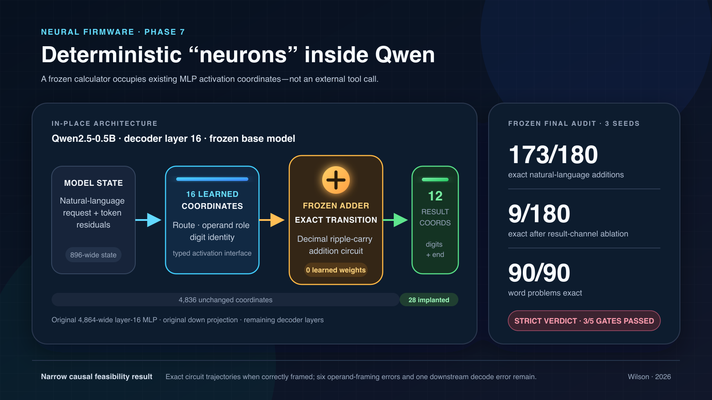

# Neural Firmware Arithmetic

This repository studies **semi-deterministic AI**: neural models that retain
learned language interpretation and flexible representations while using
small, auditable deterministic mechanisms inside native activation pathways.
Exact integer addition is the first controlled test.

The originating hypothesis is Josiah Wilson's: known deterministic processes
should be installed inside a language model as locked computational structure,
rather than learned imperfectly from examples. OpenAI Codex is assisting with
experimental design, implementation, execution, analysis, and manuscript
preparation under Josiah's direction.

**Status:** independent research artifact, released for inspection and
replication. The reports are not peer reviewed, and the repository does not
claim general mathematical reasoning or historical priority for integrated
calculators. No open-source license has been granted yet.

The newest completed experiment is summarized in
[`PHASE11_EXECUTIVE_SUMMARY.md`](PHASE11_EXECUTIVE_SUMMARY.md). The current
compiled interface-hardening report remains
[`paper_phase9/deterministic-neurons-interface-hardening.pdf`](paper_phase9/deterministic-neurons-interface-hardening.pdf).
It documents the frozen TinyLlama semantic-curriculum study, including its
negative compound result and disclosed gate-bookkeeping correction. The
earlier consolidated Qwen report remains
[`paper_phase7/deterministic-neurons-qwen.pdf`](paper_phase7/deterministic-neurons-qwen.pdf).

## Phase 11 at a glance

Phase 11 added a dedicated 4,096-weight, final-prompt-state request router to
each frozen Phase 10 local-representation checkpoint. No inherited interface,
calculator, decoder, or pretrained-model tensor changed.

On a new sealed 100-positive/200-negative audit, exact answers improved from
49/46/51 under the Phase 10 control to 67/77/68 under the Phase 11 candidate:
paired gains of +18, +31, and +17. Oracle routing remained 92/98/95, every
active-route exact-operand execution was exact, and forcing the route off
removed every normally correct candidate answer.

The compound protocol **failed**. Positive routing was only 75/79/72, and
false routes were 8/9/6 of 200. Twenty-one of 23 false routes were concentrated
in two unseen multiplication templates. Post-hoc thresholding could not
satisfy both exactness and preservation.

The narrow finding is that route-only architectural separation recovered a
large, consistent fraction of the routing gap, but a linear readout of only
the final prompt state remained brittle to new operation phrasing. See the
[`Phase 11 summary`](PHASE11_EXECUTIVE_SUMMARY.md), frozen
[`protocol`](PHASE11_AUTONOMOUS_ROUTING_PROTOCOL.md), and
[`development record`](PHASE11_AUTONOMOUS_ROUTING_DEVELOPMENT.md).

## Phase 10 at a glance

Phase 10 compared the existing linear TinyLlama implant interface with an
exactly input-budget-matched 16-unit nonlinear bottleneck and a linear
interface augmented by a rank-four representation adapter local to the
implant. The calculator, result decoder, layer, activation coordinates, base
model, and runtime remained fixed.

On a new sealed 100-positive/200-negative audit, linear reached 37/100,
35/100, and 35/100 exact. The local-representation condition reached 46/100,
42/100, and 53/100: paired gains of +9, +7, and +18. It produced zero false
routes across all 600 negative seed-prompt evaluations, preserved every
negative output token-for-token, and fell to 0/100 under result ablation.
Oracle routing reached 89/100, 90/100, and 89/100.

All frozen representation-access gates passed. The matched nonlinear condition
reached only 31/100, 30/100, and 31/100, trailing linear in every seed, so its
separate hypothesis failed.

The narrow result is that a small interface-local transform improved access to
frozen TinyLlama representations without collateral route-off changes. It did
not make the system reliable: natural exactness remained 42–53%, far below
oracle-route exactness. Semantic routing remains the primary bottleneck. See
the [`Phase 10 summary`](PHASE10_EXECUTIVE_SUMMARY.md), frozen
[`protocol`](PHASE10_INTERFACE_CAPACITY_PROTOCOL.md), and
[`lab notebook`](PHASE10_LAB_NOTEBOOK.md).

## Phase 9 at a glance

Phase 9 kept the Phase 8 TinyLlama calculator, layer, 28 activation
coordinates, 24,576 learned result weights, base model, and runtime state
fixed. It updated only the 32,768 linear input-interface weights. Three paired
seeds compared count-matched generic continuation with hard semantic-contrast
continuation on a sealed audit of 100 additions and 200 adversarial negatives.

The hard condition reached 61/100, 61/100, and 58/100 exact additions. Generic
continuation reached 59/100, 63/100, and 58/100; the unchanged Phase 8
implants reached 67/100, 68/100, and 68/100. Hard training improved exact
operand registers to 81–85/100 and reduced Phase 8 false routes from
26–30/200 to 11–12/200, but it routed off exactly 24/100 additions in every
seed and produced more false routes than generic continuation's 8/200.

The compound protocol **failed**. The protocol-defined conditional mechanism
passed: all 61/61, 60/60, and 57/57 active-route, exact-operand examples had
exact calculator trajectories and exact decoded answers. Result ablation
reduced every seed to 0/100. The other five gates failed.

The frozen evaluator's raw JSON marks the conditional gate false because of a
disclosed aggregate-count bug involving two numerically correct
`047 + 150` registers. Row-level recomputation makes that gate pass without
changing the compound verdict. Both records are retained.

The result is a useful negative capacity finding: hard contrasts moved
TinyLlama's frozen linear decision boundary and improved specific state typing,
but did not create a broadly reliable interface. See
[`PHASE9_EXECUTIVE_SUMMARY.md`](PHASE9_EXECUTIVE_SUMMARY.md), the frozen
[`Phase 9 protocol`](PHASE9_INTERFACE_HARDENING_PROTOCOL.md), and the
complete [`Phase 9 lab notebook`](PHASE9_LAB_NOTEBOOK.md).

## Phase 8 at a glance

Phase 8 moved the same 28-coordinate, zero-parameter addition circuit to frozen
TinyLlama-1.1B at decoder layer 15. The neural implant and a conventional
rank-14 residual adapter each had exactly 57,344 learned weights.

Across three independent seeds, the implant returned 53/60 exact additions
per seed, versus 0/60 for untouched TinyLlama under the same strict response
budget and 16/60, 8/60, and 12/60 for the matched adapters. All 53 valid
calculator trajectories per seed decoded exactly, while result ablation
reduced every seed to 0/60.

This was **not** a preregistered pass. Each seed recovered exact operands on
only 54/60 prompts, and adversarial negatives produced 12, 12, and 9 false
routes. The errors were systematic across seeds and concentrated in unseen
multiplication contrasts, one factual-number template, reversed-order
instructions, and one word-problem family.

The result is therefore a partial cross-model replication: the deterministic
mechanism transfers, but the learned semantic interface is not yet robust.
See [`PHASE8_EXECUTIVE_SUMMARY.md`](PHASE8_EXECUTIVE_SUMMARY.md), the frozen
[`Phase 8 protocol`](PHASE8_SECOND_MODEL_REPLICATION_PROTOCOL.md), and the
complete [`Phase 8 lab notebook`](PHASE8_LAB_NOTEBOOK.md).

## Phase 7 at a glance



The implant occupies 28 of the 4,864 activation coordinates in Qwen's
layer-16 MLP: 16 learned operand coordinates feed a frozen, zero-parameter
ripple-carry adder, which writes 12 result coordinates. In the frozen
three-seed audit it produced 173/180 exact natural-language additions and
90/90 exact word problems; ablating the result channel reduced accuracy to
9/180. The strict preregistered verdict was 3/5 gates passed, so this is a
narrow causal-feasibility result rather than a claim of solved general
reasoning. A vector version is available in
[`assets/neural-firmware-phase7-card.svg`](assets/neural-firmware-phase7-card.svg).

## First study

The study compares:

1. a character-level causal transformer trained on addition;
2. the same transformer with a frozen ripple-carry transducer injected as a
   latent code at answer-generation positions;
3. a direct-logit oracle integration that establishes the deterministic
   subsystem's upper bound.

Training operands contain 1–6 digits. The preregistered primary endpoint is
exact-match accuracy on randomly generated 7–12 digit additions. Secondary
tests include 13–20 digit operands and adversarial carry chains.

Across three confirmatory seeds, the generic transformer averaged 90.13%
exact-match accuracy in range but produced no correct answer on 6,000 random
out-of-range examples. The latent-firmware model answered all 10,500
confirmatory examples correctly. Setting its firmware strength to zero after
training reduced in-range accuracy to 0.1–0.4% and out-of-range accuracy to
zero.

The complete paper is
[`paper/neural-firmware-arithmetic.pdf`](paper/neural-firmware-arithmetic.pdf).
Read [`PROTOCOL.md`](PROTOCOL.md) before interpreting the results. It fixes the
claim boundary: the frozen module can make arithmetic execution exact, but it
does not automatically make natural-language parsing, routing, or decoding
correct.

## Pretrained-LLM study

The second experiment used the 494-million-parameter
`Qwen/Qwen2.5-0.5B-Instruct` model with every pretrained weight frozen. An
immutable decimal addition process generated deterministic digit/end symbols;
a 10,753-parameter learned bridge routed those symbols into the final
896-dimensional residual before the pretrained output head. This is internal
generation-time activation steering, not post-generation answer replacement,
but it is still output-adjacent rather than a deterministic unit inside the
repeated transformer blocks.

Across three confirmatory bridge seeds, latent firmware achieved 900/900
(100%) on five- to eight-digit OOD addition, compared with 189/900 (21.0%) for
a 270,336-parameter all-layer LoRA control. It also achieved 450/450 carry
chains and 864/900 (96.0%) on nine- to twelve-digit random additions.

The study was **not an overall preregistered success**. Token-exact preservation
on unrelated controls was 289/300 (96.3%), below the fixed 99% threshold. All
11 divergences were late activations on prompts that quoted a valid calculator
command while instructing the model to ignore it. This is a useful negative
result: exact computation still requires exact scoping and sequence-level
routing.

The primary phase-2 report is
[`paper_phase2/neural-firmware-pretrained-llm.pdf`](paper_phase2/neural-firmware-pretrained-llm.pdf).
The frozen protocol is [`PHASE2_PROTOCOL.md`](PHASE2_PROTOCOL.md), and the full
chronological record is
[`PHASE2_LAB_NOTEBOOK.md`](PHASE2_LAB_NOTEBOOK.md).

## Internal transformer-unit study

The third experiment implements the closer version of the originating idea:
the original sixth decoder block is wrapped in-place inside Qwen's repeated
layer stack with a learned residual-to-digit encoder, a frozen zero-parameter
ripple-carry cell, and a learned typed-symbol-to-residual decoder. Eighteen
unchanged transformer blocks and the original output path remain downstream.
This is neither post-inference correction nor an output-logit tool.

The two learned interfaces contain 18,826 parameters (about 0.0038% of the
494-million-parameter base). A same-depth learned adapter with exactly 18,826
parameters served as the control. Both saw only one- to four-digit training
addition.

Across three frozen confirmatory seeds, the internal deterministic unit
achieved:

- 450/450 exact on primary five- to eight-digit OOD addition;
- 450/450 exact on nine- to twelve-digit addition;
- 225/225 exact on carry chains;
- 1,575/1,575 exact internal operand-register recoveries;
- 300/300 token-exact preservation comparisons;
- 90/90 wrong-state and 39/39 donor-state causal interventions.

The parameter-matched learned control scored 0/450 on both random OOD splits.
Turning the deterministic unit off reduced primary accuracy to 0/450. The
correct first-digit logit margin remained positive after all eighteen
downstream blocks. All eight preregistered criteria passed.

The primary phase-3 report is
[`paper_phase3/native-deterministic-transformer-unit.pdf`](paper_phase3/native-deterministic-transformer-unit.pdf).
The frozen protocol is [`PHASE3_PROTOCOL.md`](PHASE3_PROTOCOL.md), and the
replication-oriented chronology is
[`PHASE3_LAB_NOTEBOOK.md`](PHASE3_LAB_NOTEBOOK.md).

## Natural-language routing and same-prompt study

The fourth experiment replaced the registered command with varied ordinary
English. A learned request-level router after Qwen's twenty-fourth block chose
whether to invoke the frozen typed addition cell. A fixed boundary supplied
the two candidate decimal strings but did not choose the operation. The
untouched base, an exactly parameter-matched learned residual adapter, and the
deterministic architecture received identical prompts.

On 400 frozen, never-used confirmatory addition prompts:

- untouched base: 68/400 (17.0%);
- equal-parameter learned control: 21/400 (5.25%);
- learned-router deterministic internal model: 360/400 (90.0%);
- oracle-route deterministic internal model: 400/400 (100%).

Every one of the 349 automatically activated deterministic executions was
exact. The internal model gained 73.0 percentage points over base and 84.75
points over the matched learned control. It produced zero false activations on
160 unseen non-addition prompts and preserved all 160 base outputs
token-for-token. With the unit forced off, all 400 positive outputs were
token-identical to base.

The compound preregistered verdict is not a full pass: five of six criteria
passed, but positive routing coverage was 87.25%, below the fixed 90%
threshold. The arithmetic mechanism worked without an observed error; semantic
route recall remains the bottleneck.

This phase does not originate the general integrated-calculator concept.
Dietz and Klakow's 2025
[Integrated Gated Calculator](https://arxiv.org/abs/2501.00684) is direct
prior work on a frozen Llama 3.1 8B model. Phase 4 is best read as an
independent small-model replication and controlled extension, distinguished
by its 24,225-parameter interface, exact parameter-matched control,
precommitted same-prompt evaluation, held-out natural-language routing, and
causal on/off tests. The different reported accuracies are not directly
comparable because the models and tasks differ.

The full phase-4 paper is
[`paper_phase4/natural-language-deterministic-arithmetic.pdf`](paper_phase4/natural-language-deterministic-arithmetic.pdf).
For a concise explanation, see
[`PHASE4_EXECUTIVE_SUMMARY.md`](PHASE4_EXECUTIVE_SUMMARY.md). The frozen
protocol and chronological record are
[`PHASE4_CONFIRMATORY_PROTOCOL.md`](PHASE4_CONFIRMATORY_PROTOCOL.md) and
[`PHASE4_LAB_NOTEBOOK.md`](PHASE4_LAB_NOTEBOOK.md).

## Typed firmware versus IGC-style study

The fifth experiment directly compared the fixed-parser typed architecture
with an independently implemented learned-input/calculator/output
architecture inspired by IGC. Every condition used the same frozen
Qwen2.5-0.5B-Instruct revision, addition data, three paired training seeds,
400 held-out positive prompts per seed, and 160 adversarial negatives per
seed.

Confirmatory mathematical accuracy was:

- untouched base: 68/400 (17.0%);
- ordinary 24,225-parameter adapter: 33/1,200 (2.75%);
- 24,225-parameter typed firmware: 1,200/1,200 (100%);
- matched 24,225-parameter IGC-style model: 1/1,200 (0.083%);
- native 597,819-parameter IGC-style model: 1,084/1,200 (90.33%).

Typed minus native accuracy was +9.67 percentage points, with a frozen paired
crossed seed/prompt bootstrap 95% interval of +4.33 to +15.25 points. Typed
therefore passed the precommitted parameter-efficiency rule: it was more
accurate, used 24.68 times fewer learned parameters, and had equal
preservation.

The boundary is important. Typed firmware received its operands from a fixed
decimal parser. Native IGC learned operand extraction and recovered exact
registers on 1,083/1,200 prompts; all 1,083 eligible calculator executions
were correct. The matched-budget IGC result shows that the selected tiny input
mapper failed, not that learned parsing is impossible at that budget.

This phase was not a compound safety success. Typed and native IGC each
falsely activated on 18/480 multiplication prompts and preserved only
462/480 (96.25%) negative outputs token-for-token, below the frozen 99% gate.
The arithmetic mechanism passed; robust operation routing did not.

The full phase-5 paper is
[`paper_phase5/neural-firmware-versus-igc.pdf`](paper_phase5/neural-firmware-versus-igc.pdf).
The concise result, frozen protocol, and chronology are
[`PHASE5_EXECUTIVE_SUMMARY.md`](PHASE5_EXECUTIVE_SUMMARY.md),
[`PHASE5_CONFIRMATORY_PROTOCOL.md`](PHASE5_CONFIRMATORY_PROTOCOL.md), and
[`PHASE5_LAB_NOTEBOOK.md`](PHASE5_LAB_NOTEBOOK.md).

## Fully neural natural-language interface prototype

Phase 6 removes the fixed decimal parser at inference. Early Qwen residuals
are mapped into three typed digit registers, fused early/late neural heads
decide whether addition firmware may activate, and learned third-register
occupancy selects one or two calls. The same frozen ripple-carry cell is reused
for both calls; its first typed result becomes the second call's input without
text parsing. A learned residual bridge returns the final digits through
Qwen's frozen normalization and output head.

Pilot v6 is working end to end, including chained calculation, but is not a
confirmatory result. On 880 untouched gate examples it achieved 100% exact
single-call registers, 96% exact chained registers, 92.25% positive routing,
0/480 false calls, and 70/70 exact outputs conditional on correct extraction
and routing. Route-off outputs were token-identical to the base model in all
40 integrated negative checks. The positive routing and chained extraction
rates remain below the development gates, so the frozen confirmation families
have not been evaluated.

See [`PHASE6_ARCHITECTURE_DRAFT.md`](PHASE6_ARCHITECTURE_DRAFT.md) and
[`PHASE6_PILOT_LOG.md`](PHASE6_PILOT_LOG.md) for the architecture and retained
v1-v6 failures.

The canonical follow-up is not an internal tool-call controller. It is the
[`deterministic neuron implant`](FUTURE_ARCHITECTURE_GOAL.md): replace a
low-importance MLP activation subspace with a frozen calculator-neuron bank,
then fine-tune Qwen's surrounding weights so mathematical representations
naturally organize around those neuron-shaped deterministic activations.

## In-place deterministic-neuron study

Phase 7 implements that follow-up inside 28 existing coordinates of Qwen's
4,864-wide layer-16 MLP. Sixteen learned route/role/digit coordinates feed a
frozen zero-parameter addition circuit; twelve deterministic result
coordinates return the answer through Qwen's ordinary MLP down projection and
all remaining decoder layers. The model width is unchanged. The learned input
and output interface contains 25,088 weights.

On a shared fresh holdout, three independently initialized interfaces each
scored 58/60 exact additions. Each reached 58/58 exact outputs conditional on
recovering the intended operands, while result-channel ablation reduced every
seed to 3/60. This is strong replicated causal evidence for the narrow
calculator-neuron mechanism.

The original compound protocol was not an overall success. The three routers
falsely activated on 6/60, 5/60, and 6/60 adversarial non-addition prompts.
Targeted training of only the 1,792 route-row weights then produced 0/360 false
routes and 360/360 token-exact preservation across two new three-seed audits.

A deterministic operand register removed later sequence-state drift without
changing learned weights. On the latest frozen audit, the three seeds produced
173/180 exact additions, 174/180 exact operand registers and calculator
trajectories, 90/90 exact word problems, and only 9/180 exact answers after
calculator-result ablation. One exact calculator trajectory was misdecoded by
downstream Qwen, and six prompts had wrong initial operand framing. The strict
compound verdict therefore remained negative: three of five frozen gates
passed.

The route latch, operand register, and answer-position counter remain
generation-runtime state, and the prototype performs one addition per response
rather than arbitrary recurrent calls.

See [`PHASE7_EXECUTIVE_SUMMARY.md`](PHASE7_EXECUTIVE_SUMMARY.md) for the current
concise result, [`PHASE7_OPERAND_REGISTER_PROTOCOL.md`](PHASE7_OPERAND_REGISTER_PROTOCOL.md)
for the latest frozen gates, and [`PHASE7_PILOT_LOG.md`](PHASE7_PILOT_LOG.md)
for the complete development record. The full scientific report is
[`paper_phase7/deterministic-neurons-qwen.pdf`](paper_phase7/deterministic-neurons-qwen.pdf).
The retrospective problem-by-problem comparison with untouched Qwen is
[`phase7_base_comparison/report.html`](phase7_base_comparison/report.html).

Publication-ready Phase 7 arXiv source, the anonymous MATH-AI 2026 workshop draft,
verified venue strategy, and submission checklist are staged in
[`publication/`](publication/). The clean Llama-family replication is specified
and reported in
[`PHASE8_SECOND_MODEL_REPLICATION_PROTOCOL.md`](PHASE8_SECOND_MODEL_REPLICATION_PROTOCOL.md)
and [`PHASE8_EXECUTIVE_SUMMARY.md`](PHASE8_EXECUTIVE_SUMMARY.md).

## Reproduction

```bash
uv sync --extra dev
uv run pytest
uv run nf-study --config configs/study.json
uv run nf-analyze --study artifacts/confirmatory_v1/study.json

# Pretrained-LLM confirmatory study (about 66 minutes on the recorded M4)
uv run python scripts/run_phase2_study.py \
  --config configs/phase2_study.json \
  --artifact-directory phase2_artifacts/confirmatory_v1 \
  --result-directory phase2_results/confirmatory_v1
uv run python scripts/analyze_phase2.py

# Internal transformer-unit confirmatory study
uv run python scripts/run_phase3_study.py \
  --config configs/phase3_study.json \
  --artifact-directory phase3_artifacts/confirmatory_v1 \
  --result-directory phase3_results/confirmatory_v1
uv run python scripts/analyze_phase3.py
uv run python scripts/hash_phase3_artifacts.py

# Natural-language same-prompt confirmation
uv run python scripts/run_phase4_confirmation.py
uv run python scripts/analyze_phase4_confirmation.py

# Typed firmware versus IGC-style confirmation
uv run python scripts/run_phase5_confirmation.py
uv run python scripts/analyze_phase5_confirmation.py
uv run python scripts/hash_phase5_artifacts.py

# Phase 6 development pilot and an interactive natural-language prompt
uv run python scripts/run_phase6_pilot.py
uv run python scripts/demo_phase6_neural_firmware.py \
  "Add 123 and 456, then add 7. Return digits only."

# Phase 7 in-place deterministic-neuron demonstration
uv run python scripts/demo_phase7_neuron_implant.py \
  "Let the starting count be 245; include 58 additional units. State the final count with digits and no words."

# Phase 7 untouched-base comparison
uv run python scripts/evaluate_phase7_base_comparison.py
uv run python scripts/build_phase7_base_comparison_report.py

# Phase 8 frozen second-model replication
uv run python scripts/train_phase8_implants.py
uv run python scripts/train_phase8_matched_adapters.py
uv run python scripts/evaluate_phase8_confirmation.py
uv run python scripts/analyze_phase8_confirmation.py
```

Compact metrics, raw predictions, configuration files, figures, and compiled
papers are tracked in Git. Large checkpoints remain local under ignored
artifact directories.
